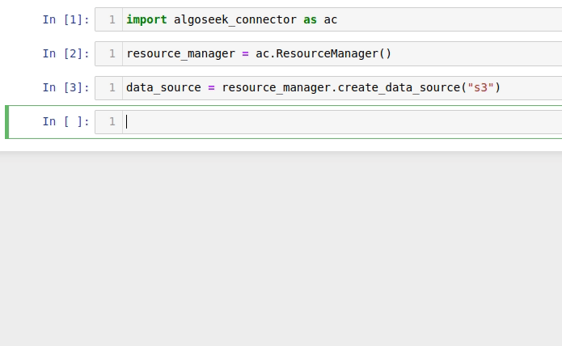
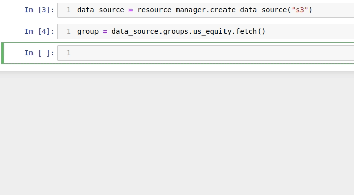
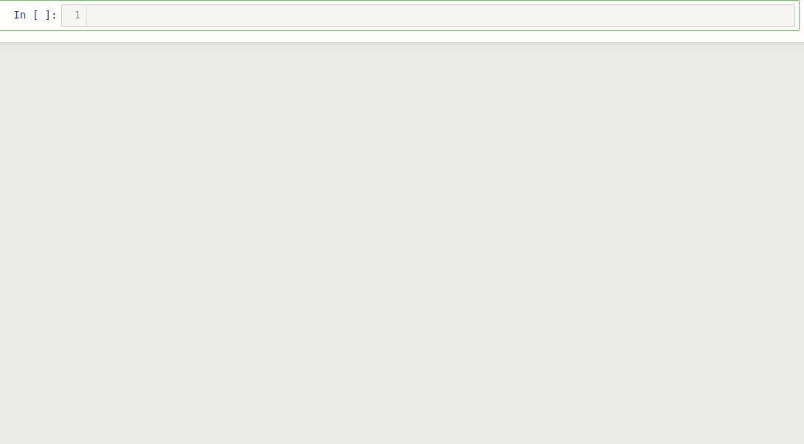
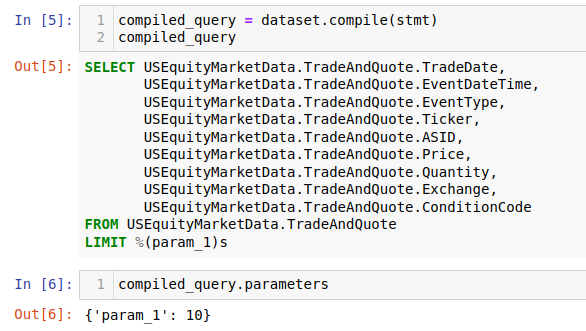

.. _datasets:

Introduction
============

Installation & initial setup
----------------------------

The algoseek-connector library is installed from the Python Package Index using
the `pip` command:

.. code-block:: shell

    pip install algoseek-connector

Before start using the library, it is necessary to set the credentials to access
data sources. The recommended way to do this is through environment variables.
The following list contains some of the most common variables:

    ALGOSEEK__ARDADB__HOST
        The IP address of the ArdaDB instance.
    ALGOSEEK__ARDADB__PORT
        The port used in the connection. If not set, port 8123 is used.
    ALGOSEEK__ARDADB__USER
        The username for DB login.
    ALGOSEEK__ARDADB__PASSWORD
        The ArdaDB user' password.
    ALGOSEEK__S3__PROFILE
        A profile name defined in `~/.aws/credentials` with access to Algoseek
        S3 datasets. If this variable is defined, ALGOSEEK__S3__ACCESS_KEY_ID and
        ALGOSEEK__S3__SECRET_ACCESS_KEY are ignored.
    ALGOSEEK__S3__ACCESS_KEY_ID
        Access ID to Algoseek S3 datasets.
    ALGOSEEK__S3__SECRET_ACCESS_KEY
        Access key to Algoseek S3 datasets.

.. code-block:: python

    import algoseek_connector as ac

    ac.config.create_config_file()

Refer to the :ref:`this guide <configuration>` for an in depth guide on how to
set the user configuration.

Getting started
---------------

The algoseek-connector library provides means to retrieve data from the different
data sources that the users has access to in a straightforward, pythonic way.

In order to fully understand how to work with the library, we present its main
components and facilities. An in-depth description of the library architecture
can be found :ref:`here <algoseek-architecture>`.

Jupyter notebooks with examples are also available in the ``examples``
directory of the library `GitHub repository <https://github.com/algoseekgit/algoseek-connector>`_.

The :py:class:`~algoseek_connector.manager.ResourceManager` is the first point of contact
to fetch data. It manages available data sources for an user:

.. code-block:: python

    import algoseek_connector as ac

    manager = ac.ResourceManager()

the :py:func:`~algoseek_connector.manager.ResourceManager.list_data_sources`
method produces a list of available data sources to connect to:

.. code-block:: python

    manager.list_data_sources()

Currently, two data sources are available: ArdaDB and S3. In the following
sections we will use the ArdaDB data source as an example, which can be
created with the
:py:func:`~algoseek_connector.manager.ResourceManager.create_data_source` method:

.. code-block:: python

    data_source = manager.create_data_source("ArdaDB")

DataSources and DataGroups
--------------------------

A :py:class:`~algoseek_connector.base.DataSource` manages the connection to a
data source and enables access to data. It manages collections of related
datasets, called data groups. Thinking in terms of relational databases, a
database is a data group, which contains several related tables (datasets). The
available data groups can be retrieved by using the
:py:func:`~algoseek_connector.base.DataSource.list_datagroups` method:

.. code-block:: python

    data_source.list_data_groups()

Also, the `groups` attribute maintains a collection of the
:py:class:`~algoseek_connector.base.DataGroup` instances available in a data source:

A data group is created either by using the fetch method of the corresponding
group:

.. code-block:: python

    group = data_source.groups.USEquityData.fetch()

or, equivalently, by using the :py:func:`~algoseek_connector.base.DataSource.fetch_datagroup`
method:

.. code-block:: python

    group = data_source.fetch_datagroup("USEquityData")

In a similar way to data sources, data groups allows to list datasets:

.. code-block:: python

    group.list_datasets()

Available datasets are also listed in the `datasets` attribute:

The members of the `datasets` attribute are instances of
:py:class:`~algoseek_connector.base.DataSetFetcher`, which are a proxy for
dataset querying and downloading, and are discussed in the next section.

DatasetFetchers & DataSets
--------------------------

The :py:class:`~algoseek_connector.base.DataSetFetcher` class is a lightweight
representation of algoseek datasets. If working on a jupyter notebook
environment, the dataset description can be displayed, with links to sample data
and documentation:

DataSetFetchers are responsible for downloading dataset files and for creating
:py:class:`~algoseek_connector.base.DataSet` instances that are able to query
data using SQL. Data from ``S3`` datasets is retrieved through the
:py:func:`~algoseek_connector.base.DataSetFetcher.download` method, which
downloads dataset files and allows filtering data by date, symbols and expiration
date in the case of options and futures datasets. See :ref:`here <S3DataSource>`
for an example of downloading data from S3 datasets. In order to retrieve data
from ``ArdaDB``, a :py:class:`~algoseek_connector.base.DataSet` must be created
using the fetch method:

.. code-block:: python

    dataset = group.datasets.TradeAndQuote.fetch()

The :py:class:`~algoseek_connector.base.DataSet` class uses the query creation
engine from `SQLAlchemy <https://www.sqlalchemy.org/>`_, providing an intuitive
interface for data retrieval. Retrieving data is a two-step process: first, a
:py:class:`~sqlalchemy.sql.expression.Select` statement is created using the
:py:func:`~algoseek_connector.base.DataSet.select` method, and then the data is
retrieved using one of the several available fetch methods:

:py:func:`~algoseek_connector.base.DataSet.fetch`
    Fetch data using Python natives types.
:py:func:`~algoseek_connector.base.DataSet.fetch_iter`
    Stream data in chunks using Python native types. Useful in cases where
    the data retrieved does not fit in memory.
:py:func:`~algoseek_connector.base.DataSet.fetch_dataframe`
    Fetch data as a :py:class:`pandas.DataFrame`.
:py:func:`~algoseek_connector.base.DataSet.fetch_iter_dataframe`
    Stream data in chunks using :py:class:`pandas.DataFrame`. Useful in cases
    where the data retrieved does not fit in memory.

In the next section we present the workflow for query construction on ArdaDB.

.. _ArdaDBDataSource:

Working with the ArdaDB data source
-----------------------------------

We cover first the case of creating an ArdaDB data source in the case where DB
credentials are not stored in environment variables. In this case they must be
passed manually:

.. code-block:: python

    # dummy values used, replace with your own
    credentials = {
        "host": "0.0.0.0"
        "port": 8123,
        "username": "username",
        "password": "password"
    }
    data_source = manager.create_data_source("ardadb", **credentials)

Once an ArdaDB data source is created, datasets are fetched as described
above:

.. code-block:: python

    group = data_source.groups.USEquityData.fetch()
    dataset = group.datasets.TradeAndQuote.fetch()

With a dataset instance created, data is queried using SQL-like constructs that
are built using the method-chaining pattern. As an example, the following code
block retrieves the first ten rows from a dataset:

.. code-block:: python

    stmt = dataset.select().limit(10)
    data = dataset.fetch(stmt)

The first line creates a :py:class:`~sqlalchemy.sql.expression.Select` object.
In the second line, the select statement is used to retrieve data using the
:py:func:`~algoseek_connector.base.DataSet.fetch` method. The fetch method
retrieves data using Python native objects. In the case where the data resulting
from a query is large, the results can be split in chunks, reducing the memory
burden. For example, the :py:func:`~algoseek_connector.base.DataSet.fetch_iter_dataframe`
yields even-sized data chunks using :py:class:`pandas.DataFrame`:

.. code-block:: python

    stmt = data.select.limit(1000000)
    chunk_size = 100000
    for df in dataset.fetch_iter_dataframe(stmt, chunk_size):
        print(df.head())
        # do something with each data chunk...

The `size` parameter is not a hard threshold on the chunk size, so the
actual data chunk size may vary depending on the DBMS.

It is often useful to see the SQL statement that will be executed before sending
it to the DB. This can be done using the
:py:func:`~algoseek_connector.base.DataSet.compile` method, which creates a
:py:class:`~algoseek_connector.base.CompiledQuery`, which is a simple data class
that stores a string representation of the parametrized query in the `sql`
attribute and the query parameters in the `parameters` attribute. If working on
a Jupyter notebook environment, the compiled query can be used to display the
query as a code block:

Creating select statements is a topic on its own. Refer to
:ref:`this guide <sql>` for a detailed description on how to create more complex
select statements.

Once data is retrieved from a dataset, several facilities are available for
exporting data. If the data was fetched using Python native types, then,
for example, export to a JSON string or a JSON file is easily achieved using the
functions :py:func:`json.dump` or :py:func:`json.dumps` from the standard
library. If the data was queried as a :py:class:`pandas.DataFrame`, several
options are available as methods, that are generally named using the convention
``to_``, for examples, exporting as csv is achieved using the
:py:func:`pandas.DataFrame.to_csv`. Finally, data may be exported as a csv to a
S3 object using the :py:func:`~algoseek_connector.base.DataSet.store_to_s3`
method, which takes as input a select statement and sends the data to S3 data
directly from the DB. The following code block stores the data generated in
the previous example into an S3 object:

.. code-block:: python

    store_params = {
        "bucket": str,  # the bucket name to store the data
        "key": str, # the object name
        "aws_access_key_id": "aws_access_key_id"
        "aws_secret_access_key": "aws_access_key_id",
    }

    dataset.store_to_s3(stmt, **store_params)

It is important to note that, besides write access to the bucket, the bucket
must exists in order to write the object. Otherwise, an error will occur.

.. _S3DataSource:

Working with the S3 data source
-------------------------------

We cover first the case of creating an S3 data source in the case where DB
credentials are not stored in environment variables. In this case they must be
passed manually:

.. code-block:: python

    # dummy values used, replace with your own
    credentials = {
        "aws_access_key_id": "aws_access_key_id",
        "aws_secret_access_key": "aws_secret_access_key",
    }
    data_source = manager.create_data_source("s3", **credentials)

Once an S3 data source is created, data can be downloaded from the dataset
using the download method:

.. code-block:: python

    from pathlib import Path

    group = data_source.groups.us_equity.fetch()
    dataset_fetcher = group.datasets.eq_taq

    # create download dir if it does not exists
    download_path = Path(".")
    download_path.mkdir(exist_ok=True)

    # set date range and symbol filters
    date_range = ("20230701", "20230731")
    symbols = ["ABC", "CDE"]
    dataset_fetcher.download(
        download_path, date=date_range, symbols=symbols
    )

The :py:func:`~algoseek_connector.base.DataSetFetcher.download` method supports
file filtering by symbols, date range and expiration date for futures and options
datasets. For detailed information on how to use the download method, refer
to the :ref:`API documentation <API>`.

It is important to be careful when selecting which data to download as large
amounts of data will result in higher costs associated with the usage of the S3
service. Currently, a hard threshold for downloading data in a single call is
set to 1 TiB.
