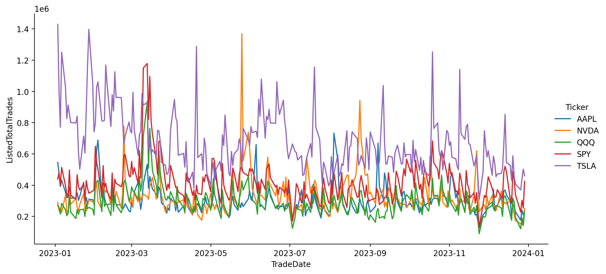
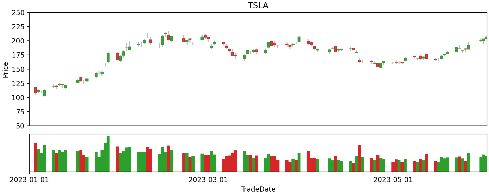

.. _query:

Querying datasets
*****************

This guide describe how to query :py:class:`~algoseek_connector.base.DataSet` objects using SQL-like
constructs. Basic query constructs are discussed and then common query examples are provided. For
instructions on how to create datasets from different data sources see :ref:`this guide <getting-started-tutorial>`.

Before starting with the description of the query generation process, it is important to make the
following remark: a good understanding of the DBMS where the data is stored is required to write
efficient queries. For example, in ArdaDB, which is implemented using `Clickhouse <https://clickhouse.com/>`_,
knowing how primary indexes are implemented will result in better performance when querying the data. See
`this article <https://clickhouse.com/docs/en/optimize/sparse-primary-indexes#data-is-organized-into-granules-for-parallel-data-processing>`_
as a reference.

Now, we are ready to review the query generation process. First, we load a dataset to use in the examples:

.. code-block:: python

    import algoseek_connector as ac

    manager = ac.ResourceManager()
    data_source = manager.create_data_source("ArdaDB")
    group = data_source.groups.USEquityMarketData.fetch()
    dataset = group.datasets.TradeOnlyMinuteBar.fetch()

The Dataset class is built on top of `SQLAlchemy <https://www.sqlalchemy.org/>`_ tables and columns
and supports most of the standard SQL operations. Dataset objects do not store data and are just a
mean to retrieve data from an external data source.

Columns and simple select statements
------------------------------------

Each dataset column is represented as a :py:class:`sqlalchemy.Column` and is accessed by using either
attribute or dict-like access:

.. code-block:: python

  # access by attribute
  col = dataset.ASID

  # access by index
  col = dataset["ASID"]

The :py:class:`~algoseek_connector.base.ColumnHandle` class also allows access to a dataset columns and
it can be created using the :py:func:`~algoseek_connector.base.DataSet.get_column_handle` method:

.. code-block:: python

    c = dataset.get_column_handle()

    # access by attribute
    c.ASID

    # access by index
    c["ASID"]

The columns of a dataset allow us to build select statements using the :py:func:`~algoseek_connector.base.DataSet.select`
method:

.. tab-set::

    .. tab-item:: Python

        .. code-block:: python

            stmt = dataset.select()

    .. tab-item:: SQL

        .. code-block:: sql

            SELECT
                USEquityMarketData.TradeOnlyMinuteBar.TradeDate,
                USEquityMarketData.TradeOnlyMinuteBar.BarDateTime,
                USEquityMarketData.TradeOnlyMinuteBar.Ticker,
                USEquityMarketData.TradeOnlyMinuteBar.ASID,
                USEquityMarketData.TradeOnlyMinuteBar.FirstTradePrice,
                USEquityMarketData.TradeOnlyMinuteBar.HighTradePrice,
                USEquityMarketData.TradeOnlyMinuteBar.LowTradePrice,
                USEquityMarketData.TradeOnlyMinuteBar.LastTradePrice,
                USEquityMarketData.TradeOnlyMinuteBar.VolumeWeightPrice,
                USEquityMarketData.TradeOnlyMinuteBar.Volume,
                USEquityMarketData.TradeOnlyMinuteBar.TotalTrades
            FROM
                USEquityMarketData.TradeOnlyMinuteBar

The SQL tab displays the equivalent select statement generated. A subset of columns can be selected by
passing them as arguments:

.. tab-set::

    .. tab-item:: Python

        .. code-block:: python

            stmt = dataset.select(
                dataset.TradeDate,
                dataset.Ticker,
                dataset.Volume,
            )

    .. tab-item:: SQL

        .. code-block:: sql

            SELECT
                USEquityMarketData.TradeOnlyMinuteBar.TradeDate,
                USEquityMarketData.TradeOnlyMinuteBar.Ticker,
                USEquityMarketData.TradeOnlyMinuteBar.Volume
            FROM
                USEquityMarketData.TradeOnlyMinuteBar

It is often the case that we want to exclude a subset of columns from the query. This is done by passing
them as a sequence to the `exclude` parameter:

.. tab-set::

    .. tab-item:: Python

        .. code-block:: python

            exclude_columns = (dataset.ASID, dataset.TotalTrades)
            stmt = dataset.select(exclude=exclude_columns)

    .. tab-item:: SQL

        .. code-block:: sql

            SELECT
                USEquityMarketData.TradeOnlyMinuteBar.TradeDate,
                USEquityMarketData.TradeOnlyMinuteBar.Ticker,
                USEquityMarketData.TradeOnlyMinuteBar.BarDateTime,
                USEquityMarketData.TradeOnlyMinuteBar.FirstTradePrice,
                USEquityMarketData.TradeOnlyMinuteBar.HighTradePrice,
                USEquityMarketData.TradeOnlyMinuteBar.LowTradePrice,
                USEquityMarketData.TradeOnlyMinuteBar.LastTradePrice,
                USEquityMarketData.TradeOnlyMinuteBar.VolumeWeightPrice,
                USEquityMarketData.TradeOnlyMinuteBar.Volume,
            FROM
                USEquityMarketData.TradeOnlyMinuteBar

Filter rows with the WHERE clause
---------------------------------

SQLalchemy columns support comparison operators:

.. code-block:: python

    # examples of comparison operators
    col1 = dataset.HighTradePrice
    col2 = dataset.LowTradePrice,

    # equality
    col1 == col2

    # greater than
    col1 > col2

    # greater than or equal
    col1 >= col2

    # between
    value1 = 1
    value2 = 2
    col1.between(value1, value2)

    # in
    list_of_values = [1, 2, 3, 4]
    col1.in_(list_of_values)

Logical operator are also overloaded:

.. code-block:: python

    # AND
    col1 & col2

    # OR
    col1 | col2

    # NOT
    ~col1

A complete reference of operators is available `here <https://docs.sqlalchemy.org/en/20/core/operators.html>`__.
Using these operators, the WHERE clause can be included using the :py:func:`~sqlalchemy.Select.where` method of
the Select construct. We present here several commonly used examples of the WHERE clause:

Filter data using a ticker symbol:

.. tab-set::

    .. tab-item:: Python

        .. code-block:: python

            tickers = "ABC"
            stmt = dataset.select().where(dataset.Ticker == tickers)

    .. tab-item:: SQL

        .. code-block:: sql

            SELECT
                USEquityMarketData.TradeOnlyMinuteBar.TradeDate,
                USEquityMarketData.TradeOnlyMinuteBar.BarDateTime,
                USEquityMarketData.TradeOnlyMinuteBar.Ticker,
                USEquityMarketData.TradeOnlyMinuteBar.ASID,
                USEquityMarketData.TradeOnlyMinuteBar.FirstTradePrice,
                USEquityMarketData.TradeOnlyMinuteBar.HighTradePrice,
                USEquityMarketData.TradeOnlyMinuteBar.LowTradePrice,
                USEquityMarketData.TradeOnlyMinuteBar.LastTradePrice,
                USEquityMarketData.TradeOnlyMinuteBar.VolumeWeightPrice,
                USEquityMarketData.TradeOnlyMinuteBar.Volume,
                USEquityMarketData.TradeOnlyMinuteBar.TotalTrades
            FROM
                USEquityMarketData.TradeOnlyMinuteBar
            WHERE
                USEquityMarketData.TradeOnlyMinuteBar.Ticker = 'ABC'

Filter data using a list of tickers:

.. tab-set::

    .. tab-item:: Python

        .. code-block:: python

            tickers = ["ABC", "DEF"]
            stmt = dataset.select().where(dataset.Ticker.in_(tickers))

    .. tab-item:: SQL

        .. code-block:: sql

            SELECT
                USEquityMarketData.TradeOnlyMinuteBar.TradeDate,
                USEquityMarketData.TradeOnlyMinuteBar.BarDateTime,
                USEquityMarketData.TradeOnlyMinuteBar.Ticker,
                USEquityMarketData.TradeOnlyMinuteBar.ASID,
                USEquityMarketData.TradeOnlyMinuteBar.FirstTradePrice,
                USEquityMarketData.TradeOnlyMinuteBar.HighTradePrice,
                USEquityMarketData.TradeOnlyMinuteBar.LowTradePrice,
                USEquityMarketData.TradeOnlyMinuteBar.LastTradePrice,
                USEquityMarketData.TradeOnlyMinuteBar.VolumeWeightPrice,
                USEquityMarketData.TradeOnlyMinuteBar.Volume,
                USEquityMarketData.TradeOnlyMinuteBar.TotalTrades
            FROM
                USEquityMarketData.TradeOnlyMinuteBar
            WHERE
                USEquityMarketData.TradeOnlyMinuteBar.Ticker IN ('ABC', "DEF")

Filter data by date:

.. tab-set::

    .. tab-item:: Python

        .. code-block:: python

            date = "20230701"
            stmt = dataset.select().where(dataset.TradeDate = date)

    .. tab-item:: SQL

        .. code-block:: sql

            SELECT
                USEquityMarketData.TradeOnlyMinuteBar.TradeDate,
                USEquityMarketData.TradeOnlyMinuteBar.BarDateTime,
                USEquityMarketData.TradeOnlyMinuteBar.Ticker,
                USEquityMarketData.TradeOnlyMinuteBar.ASID,
                USEquityMarketData.TradeOnlyMinuteBar.FirstTradePrice,
                USEquityMarketData.TradeOnlyMinuteBar.HighTradePrice,
                USEquityMarketData.TradeOnlyMinuteBar.LowTradePrice,
                USEquityMarketData.TradeOnlyMinuteBar.LastTradePrice,
                USEquityMarketData.TradeOnlyMinuteBar.VolumeWeightPrice,
                USEquityMarketData.TradeOnlyMinuteBar.Volume,
                USEquityMarketData.TradeOnlyMinuteBar.TotalTrades
            FROM
                USEquityMarketData.TradeOnlyMinuteBar
            WHERE
                USEquityMarketData.TradeOnlyMinuteBar.TradeDate = "20230701"

Filter data by date range:

.. tab-set::

    .. tab-item:: Python

        .. code-block:: python

            start = "20230701"
            end = "20230710"
            stmt = dataset.select().where(dataset.TradeDate.between(start, end))

    .. tab-item:: SQL

        .. code-block:: sql

            SELECT
                USEquityMarketData.TradeOnlyMinuteBar.TradeDate,
                USEquityMarketData.TradeOnlyMinuteBar.BarDateTime,
                USEquityMarketData.TradeOnlyMinuteBar.Ticker,
                USEquityMarketData.TradeOnlyMinuteBar.ASID,
                USEquityMarketData.TradeOnlyMinuteBar.FirstTradePrice,
                USEquityMarketData.TradeOnlyMinuteBar.HighTradePrice,
                USEquityMarketData.TradeOnlyMinuteBar.LowTradePrice,
                USEquityMarketData.TradeOnlyMinuteBar.LastTradePrice,
                USEquityMarketData.TradeOnlyMinuteBar.VolumeWeightPrice,
                USEquityMarketData.TradeOnlyMinuteBar.Volume,
                USEquityMarketData.TradeOnlyMinuteBar.TotalTrades
            FROM
                USEquityMarketData.TradeOnlyMinuteBar
            WHERE
                USEquityMarketData.TradeOnlyMinuteBar.TradeDate BETWEEN "20230701" AND "20230710"

Filter data by date range and symbol:

.. tab-set::

    .. tab-item:: Python

        .. code-block:: python

            start = "20230701"
            end = "20230710"
            ticker = "ABC"
            cond = (
                dataset.TradeDate.between(start, end) &
                (dataset.Ticker == tickers)
            )
            stmt = dataset.select().where(cond)

    .. tab-item:: SQL

        .. code-block:: sql

            SELECT
                USEquityMarketData.TradeOnlyMinuteBar.TradeDate,
                USEquityMarketData.TradeOnlyMinuteBar.BarDateTime,
                USEquityMarketData.TradeOnlyMinuteBar.Ticker,
                USEquityMarketData.TradeOnlyMinuteBar.ASID,
                USEquityMarketData.TradeOnlyMinuteBar.FirstTradePrice,
                USEquityMarketData.TradeOnlyMinuteBar.HighTradePrice,
                USEquityMarketData.TradeOnlyMinuteBar.LowTradePrice,
                USEquityMarketData.TradeOnlyMinuteBar.LastTradePrice,
                USEquityMarketData.TradeOnlyMinuteBar.VolumeWeightPrice,
                USEquityMarketData.TradeOnlyMinuteBar.Volume,
                USEquityMarketData.TradeOnlyMinuteBar.TotalTrades
            FROM
                USEquityMarketData.TradeOnlyMinuteBar
            WHERE
                (USEquityMarketData.TradeOnlyMinuteBar.TradeDate BETWEEN "20230701" AND "20230710")
                AND USEquityMarketData.TradeOnlyMinuteBar.Ticker = 'ABC'

Aggregating rows with GROUP BY
------------------------------

Row aggregation is available through the :py:func:`~sqlalchemy.Select.group_by` method, which accepts a
sequence of columns that are used perform the aggregation. Arbitrary aggregation functions can be created
with SQLAlchemy ``func`` function generator:

.. tab-set::

    .. tab-item:: Python

        .. code-block:: python

            from sqlalchemy import func

            c = dataset.get_column_handle()
            stmt = (
                dataset
                .select(
                    c.TradeDate,
                    c.Ticker,
                    func.avg(c.HighTradePrice).label("MeanHighPrice")
                )
                .group_by(c.TradeDate, c.Ticker)
            )

    .. tab-item:: SQL

        .. code-block:: sql

            SELECT
                USEquityMarketData.TradeOnlyMinuteBar.TradeDate,
                USEquityMarketData.TradeOnlyMinuteBar.Ticker,
                avg(USEquityMarketData.TradeOnlyMinuteBar.HighTradePrice) AS MeanHighPrice
            FROM
                USEquityMarketData.TradeOnlyMinuteBar
            GROUP BY
                USEquityMarketData.TradeOnlyMinuteBar.TradeDate,
                USEquityMarketData.TradeOnlyMinuteBar.Ticker,

Note that column aliasing is supported through the ``label`` method. It is important to check
the SQL reference to see which aggregate functions are available. For ArdaDB, check the supported functions
`here <https://clickhouse.com/docs/en/sql-reference/aggregate-functions>`_. The HAVING clause is also supported
through the ``having`` method:

.. tab-set::

    .. tab-item:: Python

        .. code-block:: python

            from sqlalchemy import func

            c = dataset.get_column_handle()
            stmt = (
                dataset
                .select(
                    c.TradeDate,
                    c.Ticker,
                    func.min(c.HighTradePrice).label("MinHighPrice")
                )
                .group_by(c.TradeDate, c.Ticker)
                .having(func.min(c.HighTradePrice) > 1000.0)
            )

    .. tab-item:: SQL

        .. code-block:: sql

            SELECT
                USEquityMarketData.TradeOnlyMinuteBar.TradeDate,
                USEquityMarketData.TradeOnlyMinuteBar.Ticker,
                min(USEquityMarketData.TradeOnlyMinuteBar.HighTradePrice) AS MinHighPrice
            FROM
                USEquityMarketData.TradeOnlyMinuteBar
            GROUP BY
                USEquityMarketData.TradeOnlyMinuteBar.TradeDate,
                USEquityMarketData.TradeOnlyMinuteBar.Ticker,
            HAVING
                min(USEquityMarketData.TradeOnlyMinuteBar.HighTradePrice) > 1000.0

Examples
--------

This section contain a series of typical queries to showcase library usage patterns in real scenarios.
These examples use seaborn and matplotlib and seaborn for plotting query results.
These libraries can be installed with the following command:

.. code-block:: shell

    pip install matplotlib seaborn

The examples work with the US Equities Primary Exchange Daily OHLC dataset. As a first step,
we will load the dataset:

.. code-block:: python

    from sqlalchemy import func

    from algoseek_connector import ResourceManager

    manager = ResourceManager()
    ardadb = manager.create_data_source("ArdaDB")
    us_equity_market_data_group = ardadb.groups.USEquityMarketData.fetch()
    daily_ohlc = us_equity_market_data_group.datasets.PrimaryOHLCDaily.fetch()
    c = daily_ohlc.get_column_handle()

In the first example, top 5 traded symbols are queried from ArdaDB:

.. code-block:: python

    top5_stmt = (
        daily_ohlc.select(c.Ticker)
        .where(func.toYear(c.TradeDate) == 2023)
        .group_by(c.Ticker)
        .order_by(func.sum(c.ListedTotalTrades).desc())
        .limit(5)
    )

    example1_result = daily_ohlc.fetch(top5_stmt)
    top5 = example1_result["Ticker"]
    print(top5)

Using these symbols, we can easily create a time series plot using Pandas and matplotlib:

.. code-block:: python

    top5_trades_stmt = (
        daily_ohlc
        .select()
        .where(func.toYear(c.TradeDate) == 2023)
        .where(c.Ticker.in_(top5))
    )
    top_5_trades_df = daily_ohlc.fetch_dataframe(top5_trades_stmt)

    sns.relplot(
        data=top_5_trades_df,
        x="TradeDate",
        y="ListedTotalTrades",
        hue="Ticker",
        kind="line",
        aspect=2,
    )

    
    time series of top 5 most traded symbols.

A candle chart can also be created with this data:

.. code-block:: python

    ticker = "TSLA"
    mask = top_5_trades_df.Ticker == ticker
    df_ticker = top_5_trades_df[mask]

    fig = plt.figure(figsize=(10, 4), constrained_layout=True)
    gs = fig.add_gridspec(4, 4)
    ax = fig.add_subplot(gs[0:3, :])
    ax2 = fig.add_subplot(gs[3, :])

    # set color based on bullish/bearish
    color = pd.Series("tab:green", index=df_ticker.index).where(df_ticker.ClosePrice >= df_ticker.OpenPrice, "tab:red")

    # candle shadow
    ax.vlines(df_ticker.TradeDate, df_ticker.LowPrice, df_ticker.HighPrice, colors="tab:grey", alpha=0.5)

    # candle body plot
    ax.bar(
        x=df_ticker.TradeDate,
        height=df_ticker.loc[:, ["ClosePrice", "OpenPrice"]].max(axis=1)
        - df_ticker.loc[:, ["ClosePrice", "OpenPrice"]].min(axis=1),
        bottom=df_ticker.loc[:, ["ClosePrice", "OpenPrice"]].min(axis=1),
        width=1,
        color=color,
        alpha=1,
    )

    # volume plot
    ax2.bar(
        x=df_ticker.TradeDate,
        height=df_ticker.ListedTotalVolume,
        width=1,
        color=color,
        alpha=1,
    )

    # axis config
    ax.set_title(ticker)
    ticks = ax.get_xticks()
    ax.set_ylim(50, 250)
    ax.set_xticks([])
    ax2.set_xticks(ticks)
    ax2.set_yticks([])
    ax.set_xlim(left=pd.Timestamp("2023-01-01 00:00:00"), right=pd.Timestamp("2023-06-01 00:00:00"))
    ax2.set_xlim(left=pd.Timestamp("2023-01-01 00:00:00"), right=pd.Timestamp("2023-06-01 00:00:00"))

    
    Candle chart for a selected symbol.
    

Finally, we can also cross-reference data using reference datasets:

.. code-block:: python

    reference_group = ardadb.groups.USEquityReferenceData.fetch()

    lookup = reference_group.datasets.LookupBase.fetch()

    lookup_stmt = lookup.select(lookup.SecId).where(lookup.Ticker == top5[0])
    lookup_query_result = lookup.fetch(lookup_stmt)["SecId"]
    top1_secid = lookup_query_result[0]

    print(f"The most traded equity in 2023 SecId is {top1_secid}")

    master = reference_group.datasets.SecMasterBase.fetch()

    top1_master_stmt = master.select().where(master.SecId == top1_secid)
    top1_ref_data = master.fetch(top1_master_stmt)

    print(top1_ref_data)