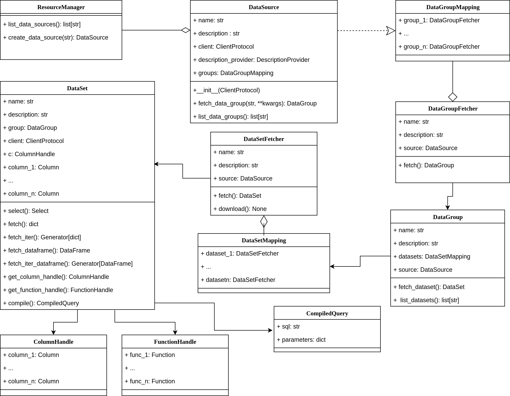

.. _developers:

Developers guide
================

.. _dev_getting_started:

Getting Started
---------------

Algoseek-connector is developed for ``Python>=3.9`` using
`Poetry <https://python-poetry.org/>`_ as the build tool. A recipe for
development installation is included in the repository `Makefile`:

.. code-block:: shell

    make dev-install

Running this command will install the package, along with dependencies to
build the documentation and execute tests.
`pre-commit <https://pre-commit.com/>`_ hooks are also installed. In order to
run integration tests, access to the different data sources is required. Contact
the :ref:`maintainers` to obtain the necessary credentials.

All contribution to the project should be made by creating feature branches and
creating a corresponding PR. Feature branches must be created from the `dev`
branch. Be sure to pass all unit and integration tests before submitting a PR.
All new features should be :ref:`tested <testing>` and
:ref:`documented <documentation>`.
Refer to their corresponding sections in this guide for more information.

.. _testing:

Testing
-------

`Pytest <https://docs.pytest.org/en/7.4.x/>`_ is used as the suite for testing.
The library tests are grouped in three different types: integration, learning and
unit:

**Unit tests**

    Check basic library component functionality. This type of tests do not
    connect to external data sources such as DB or REST APIs. If necessary,
    external connections are mocked. Unit test are executed with the following
    command:

    .. code-block:: shell

        make unit-tests

**Integration tests**
    Check library functionality in real-world scenarios, connecting to external
    data sources. Usually they take longer to run and are not executed by
    default. Integration tests are executed with the following command:

    .. code-block:: shell

        make integration-tests

**Learning tests**

    This kind of tests do not test library functionality. They are created to
    learn how third party library works and check their behavior in different
    scenarios. They are not executed by default. Learning tests are executed
    with the following command:

    .. code-block:: shell

        make learning-tests

Integration and learning tests need access to external resources to run. Access
is set through environment variables:

**Metadata API**
    Set user/pass using the environment variables ``ALGOSEEK_API_USERNAME`` and
    ``ALGOSEEK_API_PASSWORD``.

**ArdaDB**
    Set host address, port, user and password using the environment variables
    ``ALGOSEEK_ARDADB_HOST``, ``ALGOSEEK_ARDADB_USER`` and
    ``ALGOSEEK_ARDADB_PASSWORD``.

**S3**
    Set access to dataset buckets setting the variables ``ALGOSEEK_AWS_PROFILE``
    to get the credentials from ~/.aws/credentials or set user/password using
    the ``ALGOSEEK_AWS_ACCESS_KEY_ID`` and ``ALGOSEEK_AWS_SECRET_ACCESS_KEY``
    environment variables. Also, For writing to S3 buckets, access to the
    development buckets needs to be set using the environment variables
    ``ALGOSEEK_DEV_AWS_ACCESS_KEY_ID`` and
    ``ALGOSEEK_DEV_AWS_SECRET_ACCESS_KEY``.

We aim to achieve 100 % code coverage on the code base. A code coverage report
is executed with the following command:

.. code-block:: shell

    make coverage

.. _documentation:

Improving the documentation
---------------------------

The library documentation is generated using
`Sphinx <https://www.sphinx-doc.org/en/master/>`_.
The docstrings are written using the
`Numpy style <https://numpydoc.readthedocs.io/en/latest/>`_.
All public modules, classes, methods and functions **must** have a docstring.
Docstrings for private and magic functions/methods are not mandatory, but a
brief description of its usage is encouraged. Tutorials are recommended to
explain intended usage of the different facilities.

To generate the HTML documentation, execute the following command inside the
``docs`` directory:

.. code-block:: shell

    make html

Communication Channels
----------------------

You can contact one of the project :ref:`maintainers` or check the project
discussions at GitHub.

Reporting an issue
------------------

Reporting issues is very important to make ``algoseek-connector`` more reliable.
Reports can be made in the repository
`issue tracker <https://github.com/algoseekgit/algoseek-connector/issues>`_.

When submitting an issue, make sure to provide a code snippet reproducing the
problem. If an error occurs, please also provide the traceback. An explanation
of why the current behavior is not correct is also encouraged. Refer to this
`post <https://matthewrocklin.com/minimal-bug-reports>`_ for a guide on how to
write an issue report.

Also, it is worthwhile to check if the issue is already reported using the
search function of the issue tracker.

For user questions of the type "What is the best way to achieve X?", the
discussions at GitHub is a better place to ask.

Versioning and Release Process
------------------------------

``algoseek-connector`` releases follows the
`semantic versioning <https://semver.org/>`_ convention. Releases follow the
notation ``MAJOR.MINOR.PATCH``. API breaking changes must occur only in
**major** version changes, the only exception being bug fixes. **Minor** changes
include new features while maintaining API compatibility.
See Poetry's `version command <https://python-poetry.org/docs/cli/#version>`_
to bump the project version.

Feature deprecation must be announced through a warning, displaying the version
where deprecation will occur (major change) and marked both in the issue
tracker in the GitHub repository and with the `..deprecated::` directive in
the function/class docstring. If available, an alternative must be included in
the deprecation announcement.

.. _algoseek-architecture:

Algoseek-connector architectural overview
-----------------------------------------

``algoseek-connector`` aims to provide a fast, high-level, easy-to-use library
to fetch data from Algoseek datasets. In order to achieve this, we adhere to the
following principles:

- performance is a top priority.
- The number of dependencies must be kept to a minimum.
- Provide a unified interface to access datasets.
- Provide utilities to aid the user in dataset exploration.

Te overall architecture and functionality responds to these principles. The
following figures display the different modules of the library and the
architecture of the library API.

We can follow, in a top-bottom fashion, how the different classes are used by
an user:

**ResourceManager**
    The first point of contact of the user with the library. It lists and
    creates the different data sources. It is basically a DataSource factory.
**DataSource**
    A data source manages the connection to a data source (ArdaDB or S3) and
    displays the different data groups. In other words, it orchestrates the
    process of requesting data. :ref:`Below <creating-new-data-sources>` we
    discuss how to extend the library, creating new data sources.
**DataGroupMapping**
    A mapping class that stores a lightweight representation of data groups.
    It is used in the `groups` attribute of DataSource to display all available
    data groups at run time.
**DataGroupFetcher**
    A lightweight representation of a data group. It stores a description of
    the datagroup (see DataGroupDescription) and creates a DataGroup when
    requested.
**DataGroupDescription**
    A container class that stores the name and description of a data group.
**DataGroup**
    Manages a collection of related datasets.
**DataSetMapping**
    A mapping class that stores a lightweight representation of datasets. It is
    used in the `datasets` attribute of DataGroup to display all available
    datasets at run time.
**DataSetFetcher**
    A lightweight representation of a dataset. It stores a description of the
    dataset (see DataSetDescription) and provides functionality to download data
    from a dataset, in the case of S3 datasets, and to create a DataSet for
    querying data using SQL, in the case of ArdaDB.
**DataSetDescription**
    A container class that stores the name and description of a dataset, along
    with links to the dataset documentation and ColumnDescription.
**DataSet**
    A representation of a dataset using SQLAlchemy utilities. It provides
    functionality to fetch data from a dataset using SQL-like queries.

.. _creating-new-data-sources:

Creating new data sources
-------------------------

The :py:class:`algoseek_connector.base.DataSource` is created using two
components: a ``ClientProtocol`` and a ``DescriptionProvider``. The interface
for both components is enforced through structural subtyping, using
`Python Protocols <https://peps.python.org/pep-0544/>`_. That is, to create
a new data source, both components must be created and they must implement the
corresponding protocol.

The ``DescriptionProvider`` provides descriptions for the data groups and datasets
available in a data source and needs to implement three methods:

``get_data_group_description``
    Takes a data group name and returns a
    :py:class:`~algoseek_connector.base.DataGroupDescription`.
``get_dataset_description``
    Takes a data group name and a dataset name and returns
    :py:class:`~algoseek_connector.base.DataSetDescription`.
``get_columns_description``
    Takes a dataset name and returns a list of
    :py:class:`~algoseek_connector.base.ColumnDescription`.

The ``ClientProtocol`` manages the connection to the data. Depending on the subset
of functionality required for each data source, different methods needs to be
implemented.

At a minimum, the ``list_data_groups`` and ``list_dataset`` method must be
implemented, which return a list of available data groups and datasets
respectively.

For downloading data, the ``download`` method must be implemented. Check the
signature of the method in the source code.

For querying data using SQL-like constructs, several methods must be implemented.
First, the ``get_dataset_columns`` creates SQLAlchemy Column constructs for
a dataset and allows the creation of :py:class:`~algoseek_connector.base.DataSet`
instances. The `compile` method, which takes a SQLAlchemy Select statement and
returns a :py:class:`~algoseek_connector.base.CompiledQuery` must also be
implemented. The implementation of this method depends on the specific
characteristics of the DB used, but it usually involves compiling the Select
statement using a SQLAlchemy Dialect.

Once these methods are implemented, the different ways to fetch data from
a dataset can be implemented:

``fetch``
    Fetch data using a CompiledQuery and returns a dictionary where keys are
    column names and values are tuples containing values of each row.
``fetch_iter``
    The same as ``fetch`` but the data is yielded in even-sized chunks.
``fetch_dataframe``
    Fetch data using a CompiledQuery and returns a pandas DataFrame.
``fetch_iter_dataframe``
    The same as ``fetch_dataframe`` but the data is yielded in even-sized chunks.
``execute``
    Executes SQL queries passing statements as strings.
``store_to_s3``
    Stores the query results into an S3 object.

.. _maintainers:

Project maintainers
-------------------

- Gabriel Riquelme: gabrielr [at] algoseek [dot] com
- Taras Kuzyo: taras [at] algoseek [dot] com
